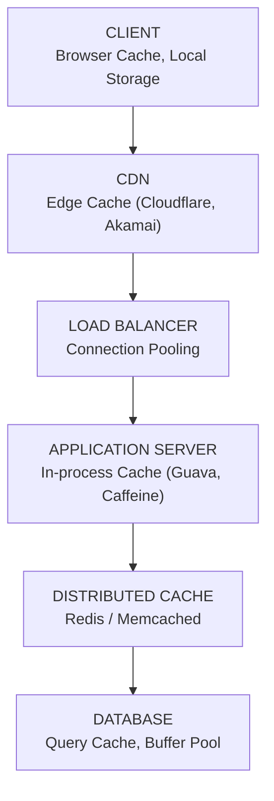

# What is Caching?
It is a process of storing **a copy of data in a faster, temporary storage layer** so that future requests for that data can be served faster without going back to the original, slower source.
The cached copy is called a **cache entry**.
The storage layer is called a **cache**.

# The core problem caching solves
Every system has a speed mismatch between layers:

| CPU Operations | ~1 nanosecond |
|--------|--------|
| RAM Access  | ~100 nanoseconds  |
| SSD Read  | ~100 microseconds |
| Network DB Query  | ~10–100 milliseconds |

That means a DB query is 1,000,000x slower than CPU operations.<br>
Caching solves this by absorbing the majority of reads before they reach the DB.

# Why Caching?
- Reduce Latency
  - **Without cache**: User → App → DB → App → User   (~50–100ms) 
  - **With cache**: User → App → Cache → User       (~1–5ms). <br>Improvement: 10x to 100x faster response
- Reduce Database Load
  - **Without cache**: 10,000 req/sec → 10,000 DB queries/sec → DB overwhelmed <br>
  - **With cache** (90% hit rate): 10,000 req/sec → 1,000 DB queries/sec → DB comfortable
- Increase Throughput
  - DB handles:        ~10,000 queries/sec 
  - Redis handles:     ~100,000 queries/sec 
  - Same hardware, 10x more requests served.
- Reduce Cost
  - DB read   = expensive (compute + I/O + licensing)
  - Cache hit = cheap     (pure memory read)
  - At scale: millions of $ saved in infrastructure

# Where is caching used?
Every Layer


# What Data Should You Cache?
Not everything deserves to be cached. Use this framework: <br>
## ✅ Good Candidates for Caching
- Frequently read, rarely written     → Product catalog, user profiles
- Expensive to compute                → Recommendation engine results
- Same result for many users          → Homepage feed, trending topics
- Tolerable if slightly stale         → Social media counts, analytics
- Session data                        → Auth tokens, shopping cart
## ❌ Bad Candidates for Caching
- Highly personalized per request     → Real-time bank balance
- Changes every millisecond           → Stock tick data (sometimes)
- Must always be accurate             → Payment transaction status
- Rarely accessed                     → Historical audit logs
- Very large objects                  → Video files (use CDN instead)

## The Golden Rule
Cache data that is read often, written rarely, and tolerable to be slightly stale.

# The Cache Trade-off Triangle
Every caching decision involves balancing three things:

```
                 SPEED
                   /\
                  /  \
                 /    \
                /      \
               /        \
              /__________\
        CONSISTENCY     MEMORY

You can optimize for 2, but the 3rd suffers.
```
- **Speed + Memory** → Consistency suffers (stale data risk)
- **Speed + Consistency** → Memory suffers (need more cache to keep everything fresh)
- **Consistency + Memory** → Speed suffers (frequent invalidation = more DB hits)
- This triangle is the core tension in every caching discussion.

# Common Mistakes
- **Mistake 1**: Cache everything blindly.
  - Memory fills up, eviction goes crazy, hit rate drops 
- **Mistake 2:** Forget cache invalidation.
  - Users see stale data for hours 
- **Mistake 3:** No fallback when cache is down 
  - Cache outage = full system outage 
- **Mistake 4:** Cache without TTL 
  - Memory grows unbounded, eventually crashes 
- **Mistake 5:** Assume cache is always consistent with DB 
  - Race conditions cause hard-to-debug bugs
  - REALITY:  They are two separate systems, updated separately,
never atomically together.
  - RESULT:   Race conditions → stale data in cache.
    ```
    Thread A (write)          Thread B (read)
    ─────────────────         ─────────────────
    1. Write new value
    to DB ✅
                            2. Cache miss →
                              reads OLD value
                              from DB ❌
    3. Delete/invalidate
    cache entry ✅
                            4. Stores OLD value
                              back in cache ❌
    ```
  - WHY HARD: Only happens under high concurrency,
impossible to reproduce in testing.
  - If an interviewer asks "how do you keep cache consistent with DB?", 
    - A weak answer is:
      - I'll update the cache whenever I update the DB.
    - A strong answer is:
      - "Cache and DB can never be perfectly in sync because they're updated non-atomically. The right strategy depends on consistency requirements. For eventual consistency, TTL-based expiry is sufficient. For stronger consistency, I'd use explicit invalidation with a distributed lock using Redis SETNX to prevent race conditions during concurrent reads and writes."
    - FIXES:
      - TTL          → eventual consistency, simplest
      - Invalidation → reduces stale window
      - Locks        → strong consistency, most complex
